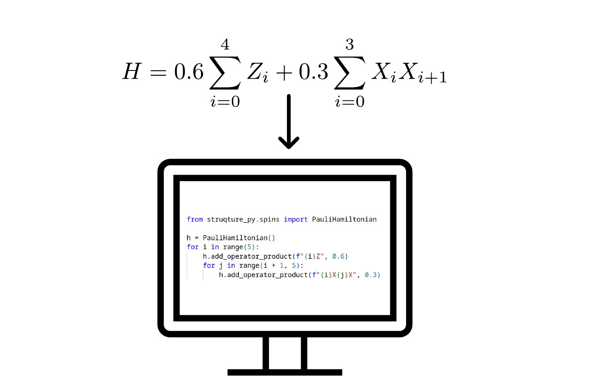

# Struqture

Struqture is a Rust (struqture) and Python (struqture-py) library by [HQS Quantum Simulations](https://quantumsimulations.de/) to represent quantum mechanical operators, Hamiltonians and open quantum systems.
The library supports building [spin](https://hqsquantumsimulations.github.io/struqture/physical_types/spins/intro.html) objects, [bosonic](https://hqsquantumsimulations.github.io/struqture/physical_types/bosons/intro.html) objects, [fermionic](https://hqsquantumsimulations.github.io/struqture/physical_types/fermions/intro.html) objects and [mixed system](https://hqsquantumsimulations.github.io/struqture/physical_types/mixed_systems/intro.html) objects that contain arbitrary many spin, bosonic and fermionic subsystems.

Struqture has been developed to create and exchange definitions of operators, Hamiltonians and open systems. A special focus is the use as input to quantum computing simulation software.



To best support this use case, struqture has a number of design goals:

* Support for arbitrary spin, bosonic, fermionic and mixed systems
* Full serialisation support to json and other formats
* Preventing construction of unphysical objects by using well defined types for all objects in struqture
* Support of symbolic values in operators, Hamiltonians and open systems

Following these design goals, we prioritize using distinctive types to construct objects over a less verbose syntax.
Similarly the support of symbolic expression leads to a trade-off in speed compared to an implementation using only floating point values.
Struqture is designed to also support the construction and (de)serialisation of large operators but for the use in numeric algorithms we recommend transforming Operators and Hamiltonians into a sparse matrix form.

## Documentation

We recommend users to start with the [user documentation](https://hqsquantumsimulations.github.io/struqture/) for stuqture and struqture-py.
The user documentation is intended to give a high level overview of the design and usage of struqture. For a full list of the available data types and functions see the API-Documentation of [struqture](https://docs.rs/struqture/) and [struqture-py](https://hqsquantumsimulations.github.io/struqture/python_api_docs/generated/struqture_py.html).

## Migration guide: from struqture 1.x to struqture 2.x

The Migration [Guide](Migration_Guide.md) should be used as a reference for anyone wanting to migrate existing code which uses struqture 1.0 or above to struqture 2.0.

## Installation

### Python

You can install `struqture_py` from PyPi. For x86 Linux, Windows and macOS systems pre-built wheels are available.
On other platforms a local Rust toolchain is required to compile the Python source distribution.

```bash
pip install struqture-py
```

### Rust

You can use struqture in your Rust project by adding

```TOML
struqture = { version = "1.2" }
```

 to your Cargo.toml file.

This project has been partly supported by [PlanQK](https://planqk.de) and is partially supported by [QSolid](https://www.q-solid.de/) and [PhoQuant](https://www.quantentechnologien.de/forschung/foerderung/quantencomputer-demonstrationsaufbauten/phoquant.html).

## Contributing

We welcome contributions to the project. If you want to contribute code, please have a look at CONTRIBUTE.md for our code contribution guidelines.
